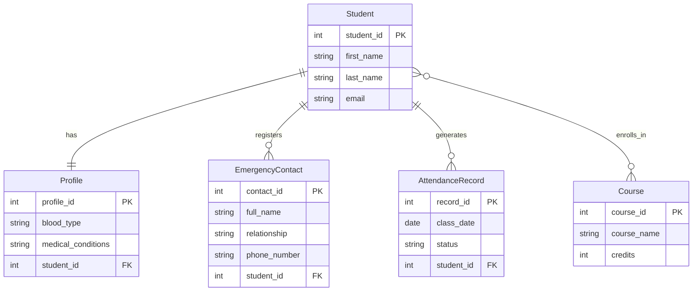

## Entitiy Realtionship Diagram

```mermaid
erDiagram
    %% ---------------------------------------------------------
    %% Core Entity
    %% ---------------------------------------------------------
    Student {
        int student_id PK
        string first_name
        string last_name
        string email
    }

    %% ---------------------------------------------------------
    %% 1:1 Relationship (One-to-One)
    %% A student has exactly one extended profile (e.g., medical info)
    %% ---------------------------------------------------------
    Profile {
        int profile_id PK
        string blood_type
        string medical_conditions
        int student_id FK
    }
    
    %% ---------------------------------------------------------
    %% 1:Few Relationship (One-to-Few)
    %% A student typically has 1 to 3 emergency contacts
    %% ---------------------------------------------------------
    EmergencyContact {
        int contact_id PK
        string full_name
        string relationship
        string phone_number
        int student_id FK
    }
    
    %% ---------------------------------------------------------
    %% 1:N Relationship (One-to-Many / Unbounded)
    %% A student generates many attendance records over the semesters
    %% ---------------------------------------------------------
    AttendanceRecord {
        int record_id PK
        date class_date
        string status
        int student_id FK
    }
    
    %% ---------------------------------------------------------
    %% N:M Relationship (Many-to-Many)
    %% Students take multiple courses, and courses have multiple students
    %% ---------------------------------------------------------
    Course {
        int course_id PK
        string course_name
        int credits
    }
    
    %% =========================================================
    %% Relationship Definitions
    %% =========================================================
    
    %% One-to-One
    Student ||--|| Profile : "has"
    
    %% One-to-Few
    Student ||--o{ EmergencyContact : "registers"
    
    %% One-to-Many
    Student ||--o{ AttendanceRecord : "generates"
    
    %% Many-to-Many
    Student }o--o{ Course : "enrolls_in"
```
