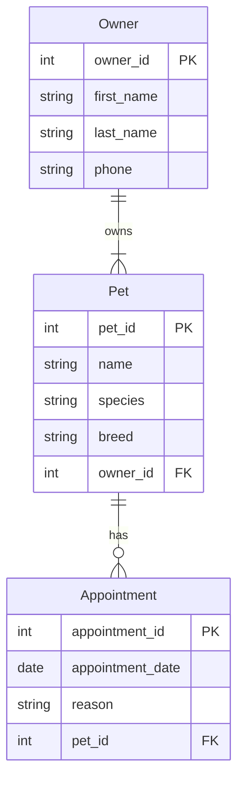

```mermaid
erDiagram
    %% The Owner entity represents the clients of the veterinary clinic
    Owner {
        int owner_id PK
        string first_name
        string last_name
        string phone
    }
    
    %% The Pet entity stores information about the animals registered in the clinic
    Pet {
        int pet_id PK
        string name
        string species
        string breed
        int owner_id FK
    }
    
    %% The Appointment entity tracks the scheduled medical visits for each pet
    Appointment {
        int appointment_id PK
        date appointment_date
        string reason
        int pet_id FK
    }
    
    %% Defining the relationships and cardinalities between entities
    
    %% A single Owner can have one or multiple Pets (1:N relationship)
    Owner ||--|{ Pet : "owns"
    
    %% A single Pet can have zero or multiple Appointments over time (1:N relationship)
    Pet ||--o{ Appointment : "has"
```
